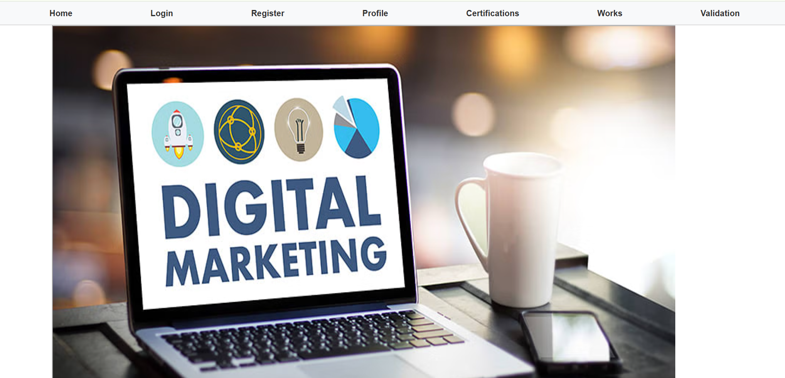

# Digital Marketing Basic

Welcome to the **Digital Marketing Basic** project! This project is a responsive and visually appealing website designed for showcasing digital marketing services. The aim is to create a professional platform to engage users and highlight various marketing strategies.

## Table of Contents
- [Features](#features)
- [Technologies Used](#technologies-used)
- [Setup and Installation](#setup-and-installation)
- [How to Use](#how-to-use)
- [License](#license)

## Features
- **Responsive Design**: Fully optimized for desktop and mobile devices.
- **Interactive Navigation**: Smooth navigation bar with hover effects.
- **Dynamic Animations**: Includes color transitions, scaling, and sliding effects for better user experience.
- **Modern Aesthetic**: Clean, professional layout with engaging visuals.

## Technologies Used
- **HTML5**: For structuring the content.
- **CSS3**: For styling and animations.
- **JavaScript (optional)**: For potential interactivity.

## Setup and Installation
Follow these steps to set up the project locally:

1. Clone the repository:
   ```bash
   git clone https://github.com/loki-4445/digital-marketing-basic.git
   ```

2. Navigate to the project directory:
   ```bash
   cd digital-marketing-basic
   ```

3. Open the project in your preferred code editor.

4. Run the project by opening `index.html` in your browser.

## How to Use
- Navigate through the website using the menu options.
- Explore the "Services" section to learn more about the offerings.
- Customize the content as needed for your business or project requirements.

## License
This project is open-source and available under the [MIT License](LICENSE).

---

Feel free to contribute, suggest improvements, or report any issues in the repository. Thank you for exploring the **Digital Marketing Basic** project!
## Screenshot


